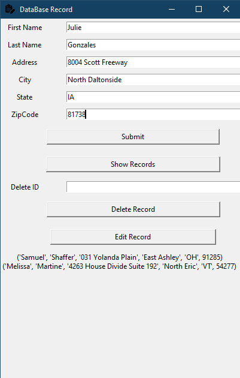

# Database-Record-Application(Database Management System)

A database management system (or DBMS) is essentially nothing more than a computerized data-keeping system. Users of the system are given facilities to perform several kinds of operations on such a system for either manipulation of the data in the database or the management of the database structure itself.

### Use this application to store, retrieve, and run queries on data such as person name,address,etc.

## Output: 

